# Praktikum Modul 2

- Andika Nugrahanto (0511194000031)
- Muhammad Rayhan Raffi Pratama (05111940000110)
- Fadhil Dimas Sucahyo (05111940000212)

## Pendahuluan

### Setting Topologi


### Edit Konfigurasi Network

#### Foosha (Router)

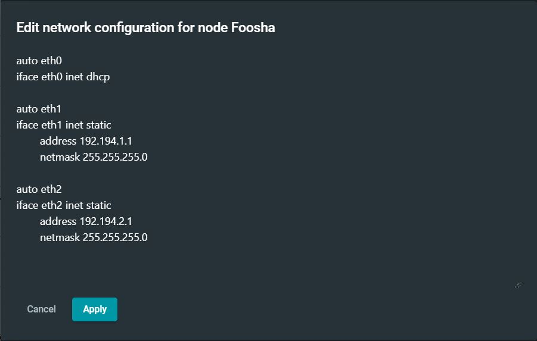

#### EniesLobby (DNS Master)

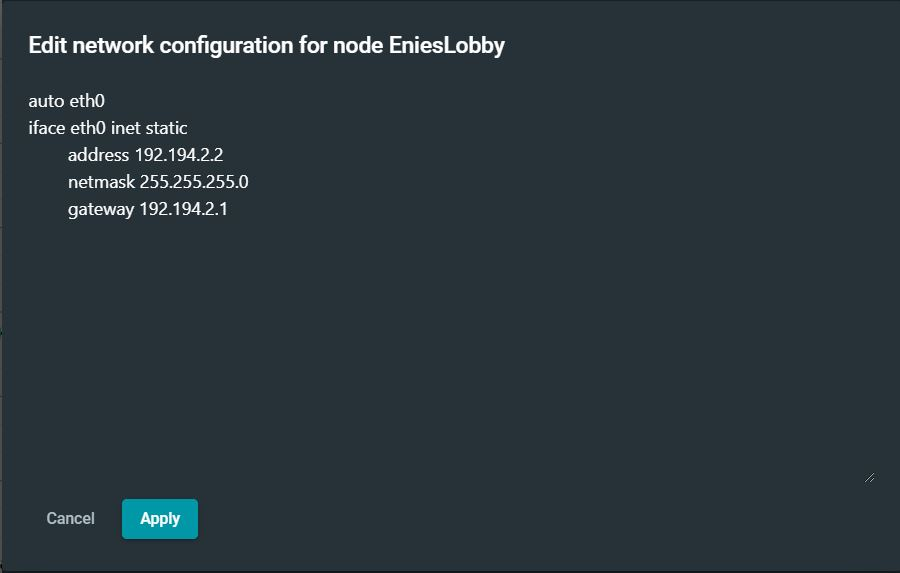

#### Water7 (DNS Slave)

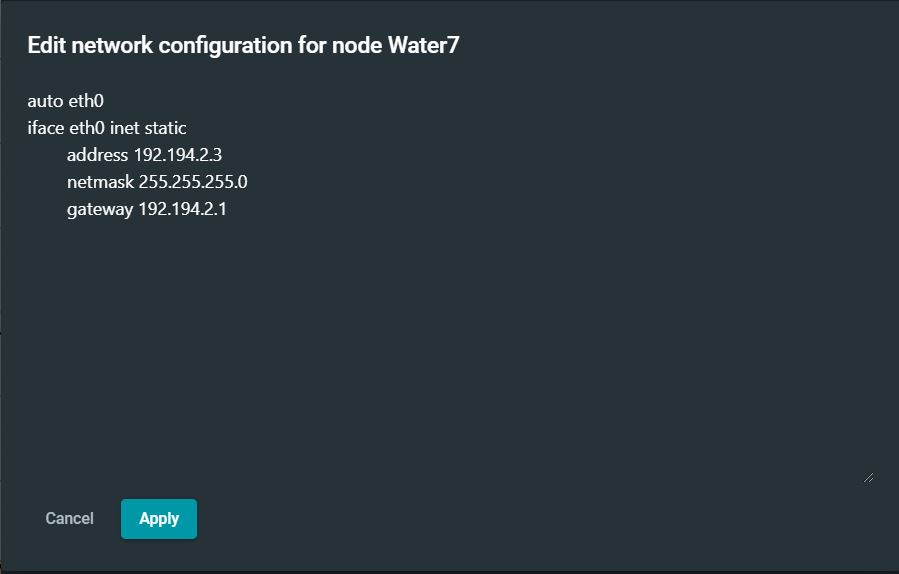

#### Skypie (Web Server)

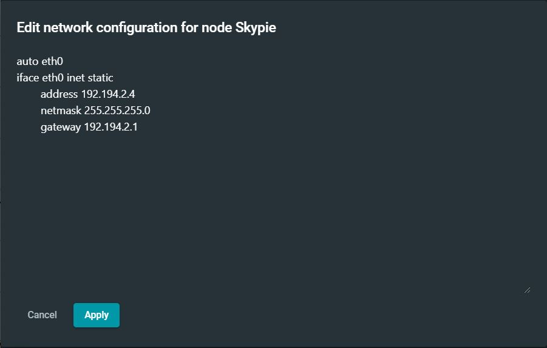

#### Loguetown (Client)

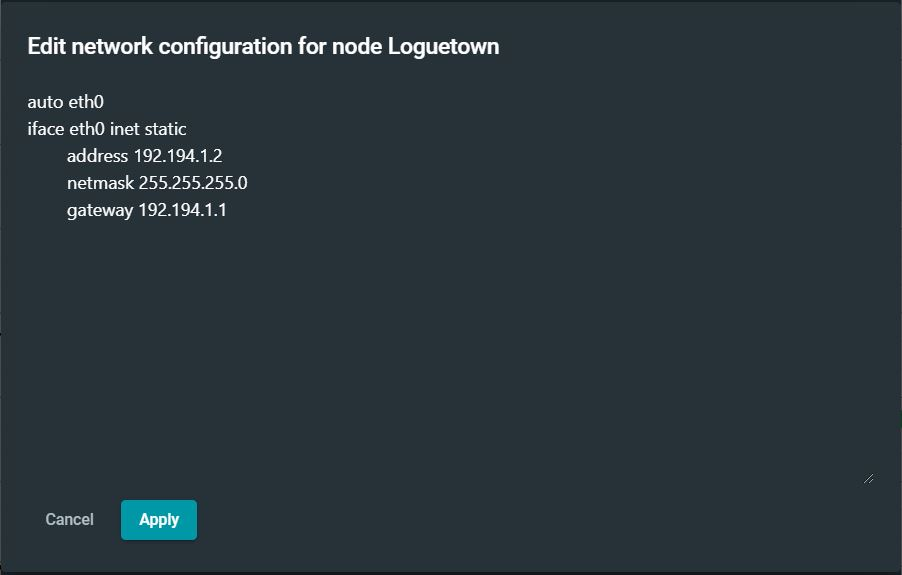

#### Alabasta (Client)

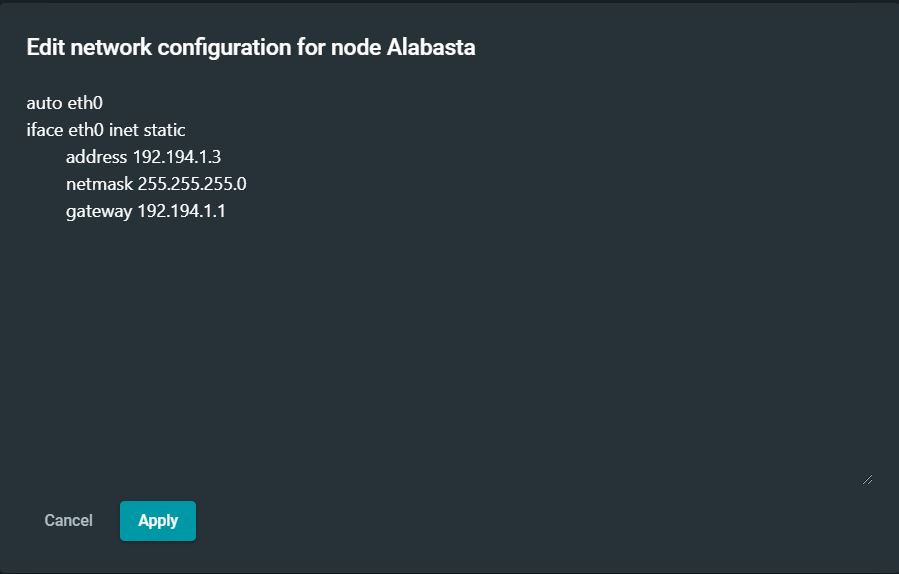

## no. 1

EniesLobby akan dijadikan sebagai DNS Master, Water7 akan dijadikan DNS Slave, dan Skypie akan digunakan sebagai Web Server. Terdapat 2 Client yaitu Loguetown, dan Alabasta. Semua node terhubung pada router Foosha, sehingga dapat mengakses internet

### Jawab

Menjalankan command `iptables -t nat -A POSTROUTING -o eth0 -j MASQUERADE -s 192.194.0.0/16` yang digunakan supaya dapat terhubung ke jaringan luar pada router `Foosha`
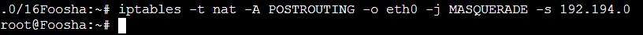

Kemudian menambahkan command `iptables -t nat -A POSTROUTING -o eth0 -j MASQUERADE -s 192.194.0.0/16` ke `/root/.bashrc` agar dijalankan setiap kali project distart dengan command `echo "iptables -t nat -A POSTROUTING -o eth0 -j MASQUERADE -s 192.194.0.0/16" >> /root/.bashrc`
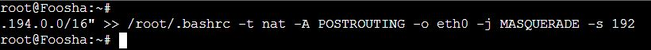

Setelah itu pada semua node lainnya ditambahkan command `echo "nameserver 192.168.122.0"` untuk setting IP DNS ke `/root/.bashrc` agar dijalankan setiap kali project distart dengan command `echo 'echo "nameserver 192.168.122.1" > /etc/resolv.conf' >> /root/.bashrc`
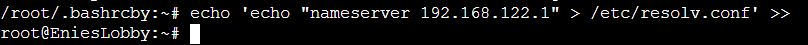

## no. 2

membuat website utama dengan mengakses franky.yyy.com dengan alias www.franky.yyy.com pada folder kaizoku

### Jawab

pada EniesLobby jalankan command `apt-get update` dan `apt-get install bind9 -y` untuk menginstall bind9
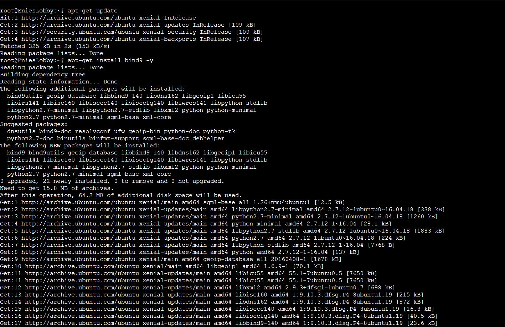

Kemudian mengedit `/etc/bind/named.conf.local` dengan menambahkan :

```bash
    zone "franky.d05.com" {
            type master;
            file "/etc/bind/kaizoku/franky.d05.com";
    };
```

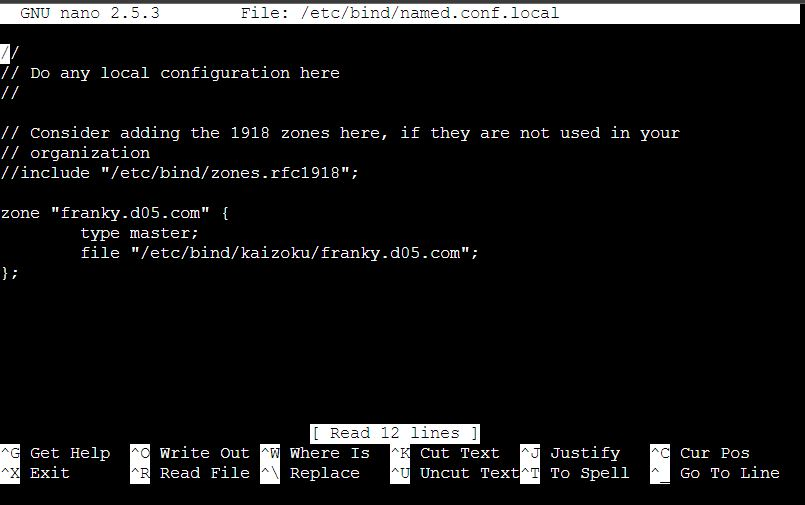

lalu dibuat folder kaizoku di `/etc/bind`. Lalu copy `/etc/bind/db.local` menjadi `/etc/bind/kaizoku/franky.d05.com`. Lalu konfigurasi file tersebut agar memiliki SOA `franky.d05.com.`, NS `franky.d05.com.`, record A yang mengarah ke `IP Skypie`, dan CNAME `www` pada `franky.d05.com.`.
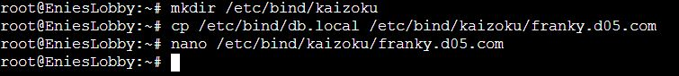
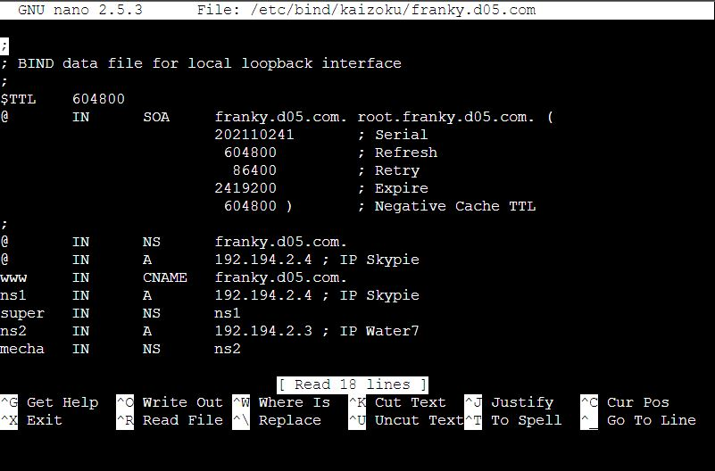

## no. 3

Setelah itu buat subdomain super.franky.yyy.com dengan alias www.super.franky.yyy.com yang diatur DNS nya di EniesLobby dan mengarah ke Skypie.

### Jawab

Mengedit file `/etc/bind/kaizoku/franky.d05.com` dengan menambahkan:

```bash
        super   IN      A       192.194.2.4
        www.super       IN      CNAME   super.franky.d05.com.
```

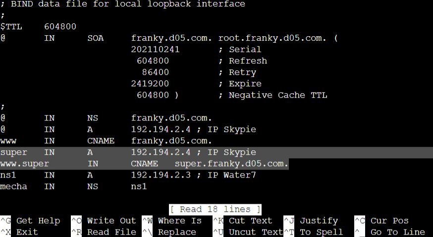

## no. 4

Buat juga reverse domain untuk domain utama

### jawab

Pertama, menambahkan zone pada `/etc/bind/named.conf.local` dengan menambahkan:

```bash
    zone "2.194.192.in-addr.arpa" {
            type master;
            file "/etc/bind/kaizoku/2.194.192.in-addr.arpa";
    };
```

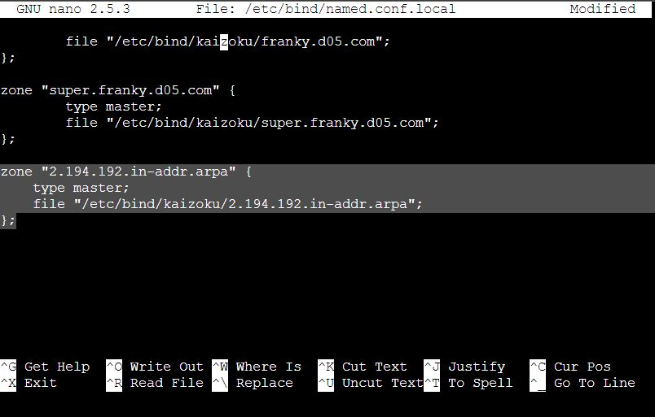

Lalu copy `/etc/bind/db.local` menjadi `/etc/bind/kaizoku/2.194.192.in-addr.arpa`. Lalu konfigurasi file tersebut agar memiliki SOA `franky.d05.com.`,`2.194.192.in-addr.arpa.` yang memiliki NS `franky.d05.com.`, dan `4` yang merupakan byte ke-4 IP EniesLobby memiliki PTR `franky.d05.com.`.

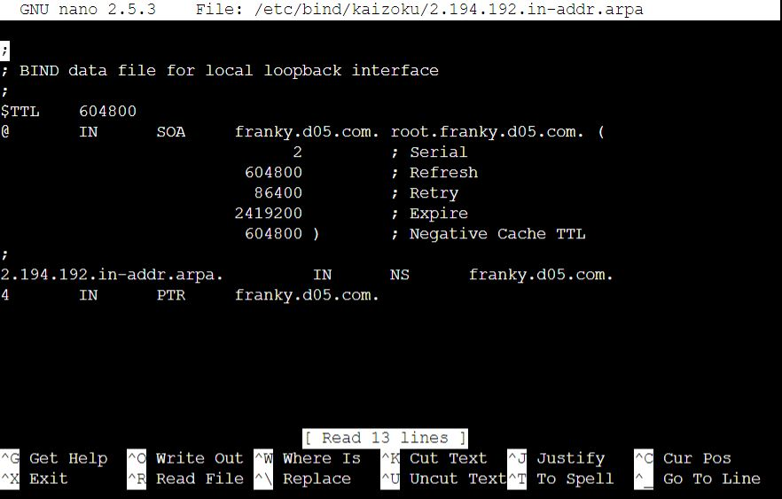

## no. 5

Supaya tetap bisa menghubungi Franky jika server EniesLobby rusak, maka buat Water7 sebagai DNS Slave untuk domain utama

### jawab

Di EniesLobby:

Pertama edit zone `franky.d05.com` pada `/etc/bind/named.conf.local` menjadi:

```bash
    zone "franky.d05.com" {
            type master;
            notify yes;
            also-notify { 192.194.2.3; };
            allow-transfer { 192.194.2.3; };
            file "/etc/bind/kaizoku/franky.d05.com";
    };
```

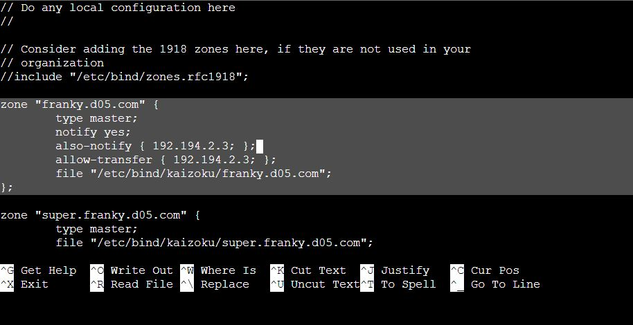

Di Water7:
Jalankan command `apt-get update` dan `apt-get install bind9 -y` untuk menginstall bind9

Kemudian mengedit `/etc/bind/named.conf.local` dengan menambahkan :

```bash
    zone "franky.d05.com" {
        type slave;
        masters { 192.194.2.2; };
        file "/var/lib/bind/franky.d05.com";
    };
```

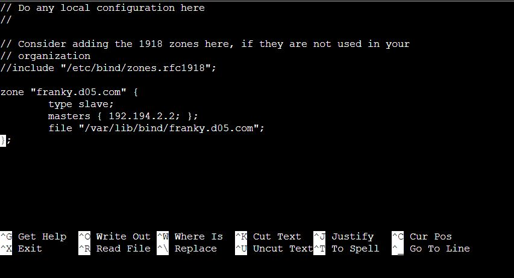

## no. 6

Setelah itu terdapat subdomain mecha.franky.yyy.com dengan alias www.mecha.franky.yyy.com yang didelegasikan dari EniesLobby ke Water7 dengan IP menuju ke Skypie dalam folder sunnygo.

### Jawab

Di EniesLobby:

Pertama, mengedit file `/etc/bind/kaizoku/franky.d05.com` dengan menambahkan:

```bash
        ns1     IN      A       192.194.2.3 ; IP Water7
        mecha   IN      NS      ns1
```

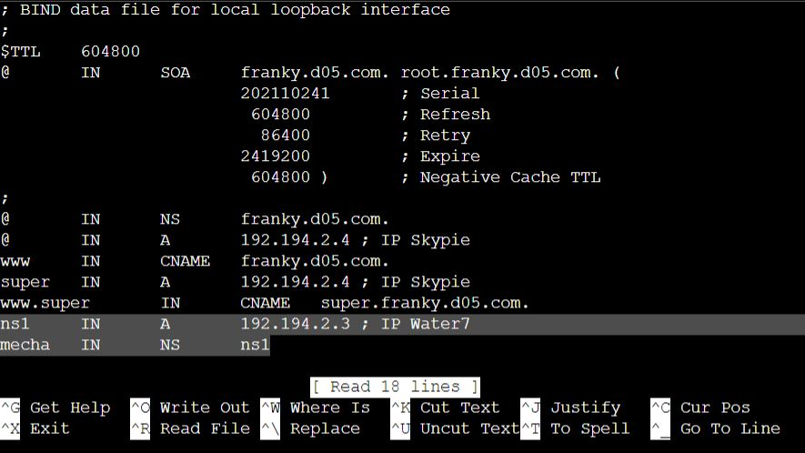

Kemudian mengedit file `/etc/bind/named.conf.options` dengan comment bagian `dnssec-validation auto;` dan menambahkan line `allow-query{any;};`.

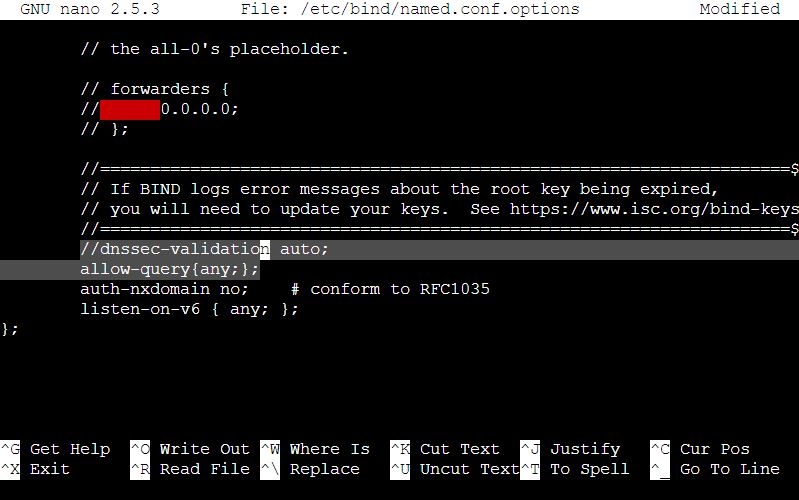

Pastikan sudah ada line `allow-transfer { "IP Water7"; };` pada zone `franky.d05.com` di file `/etc/bind/named.conf.local`.

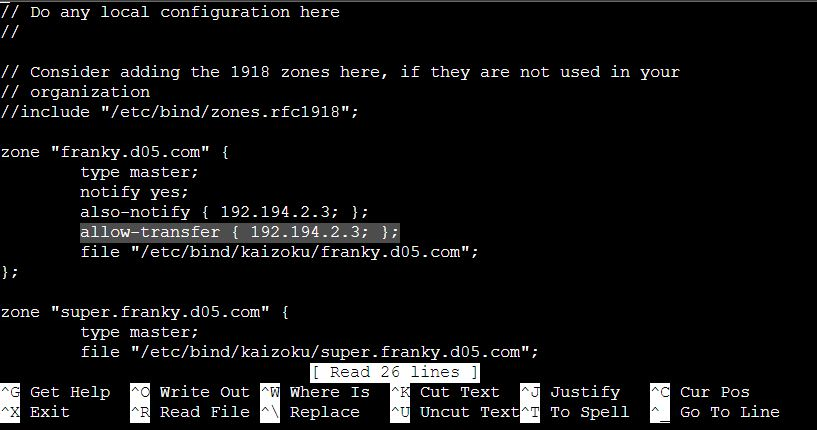

Di Water7:

Pertama edit file `/etc/bind/named.conf.options` dengan comment bagian `dnssec-validation auto;` dan menambahkan line `allow-query{any;};`.


Kemudian menambahkan zone pada `/etc/bind/named.conf.local` dengan menambahkan:

```bash
    zone "mecha.franky.d05.com" {
            type master;
            file "/etc/bind/sunnygo/mecha.franky.d05.com";
    };
```

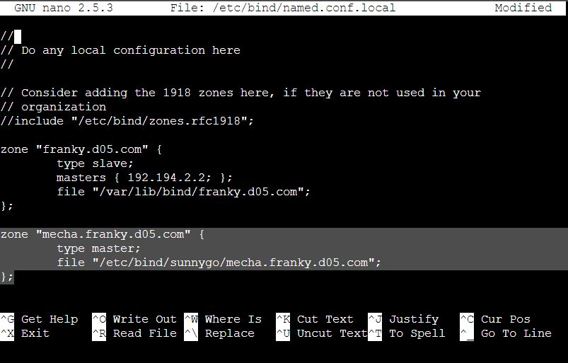

lalu dibuat folder sunnygo di `/etc/bind`. Lalu copy `/etc/bind/db.local` menjadi `/etc/bind/sunnygo/mecha.franky.d05.com`. Lalu konfigurasi file tersebut agar memiliki SOA `mecha.franky.d05.com.`, NS `mecha.franky.d05.com.`, record A yang mengarah ke `IP Skypie`, dan CNAME `www` pada `mecha.franky.d05.com.`.

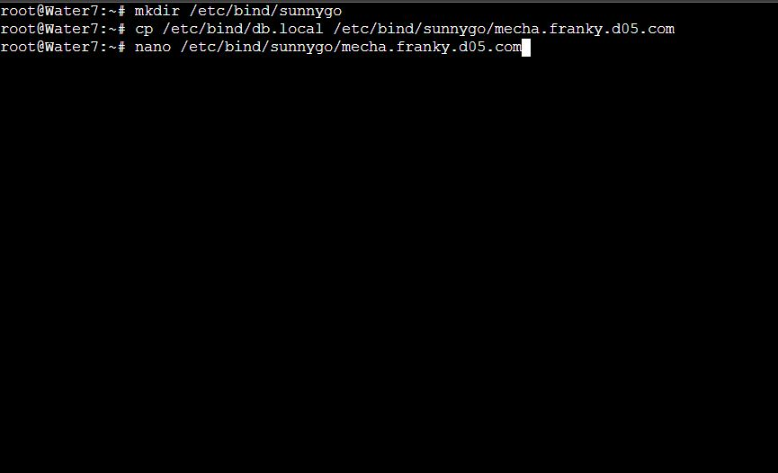
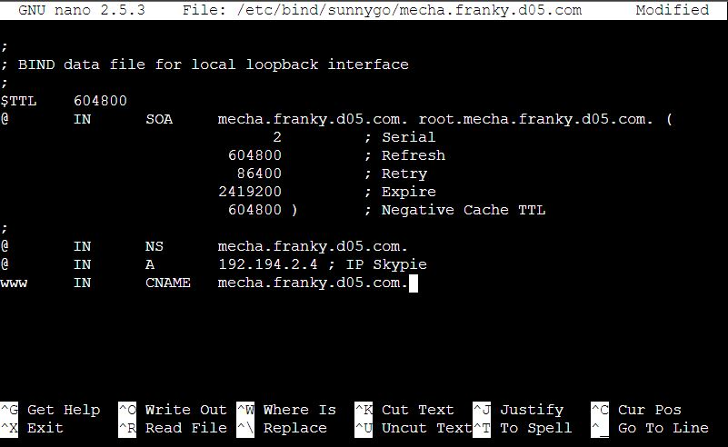

## no. 7

Untuk memperlancar komunikasi Luffy dan rekannya, dibuatkan subdomain melalui Franky dengan nama general.mecha.franky.yyy.com dengan alias www.general.mecha.franky.yyy.com yang mengarah ke Skypie.

### Jawab

Di Water7:

Mengedit file `/etc/bind/sunnygo/mecha.franky.d05.com` dengan menambahkan:

```bash
        general IN      A       192.194.2.4 ; IP Skypie
        www.general     IN      CNAME   general.mecha.franky.d05.com.
```

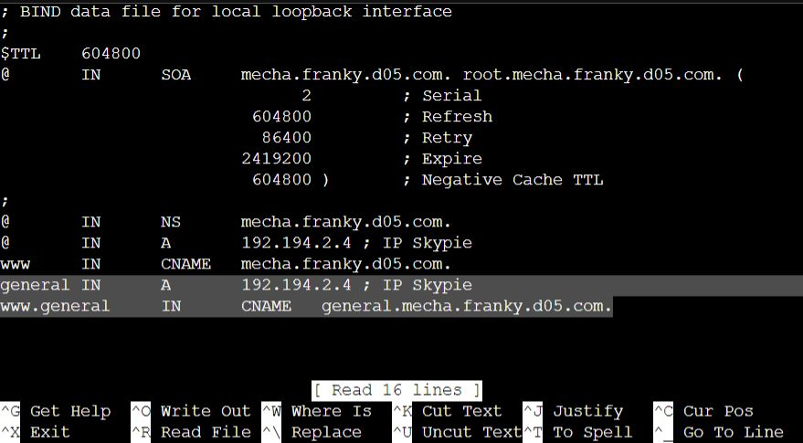

## no. 8

Setelah melakukan konfigurasi server, maka dilakukan konfigurasi Webserver. Pertama dengan webserver www.franky.yyy.com. Pertama, luffy membutuhkan webserver dengan DocumentRoot pada /var/www/franky.yyy.com.

Di Skypie:
Pertama, install `apache2`, `php`, dan `libapache2-mod-php7.0`
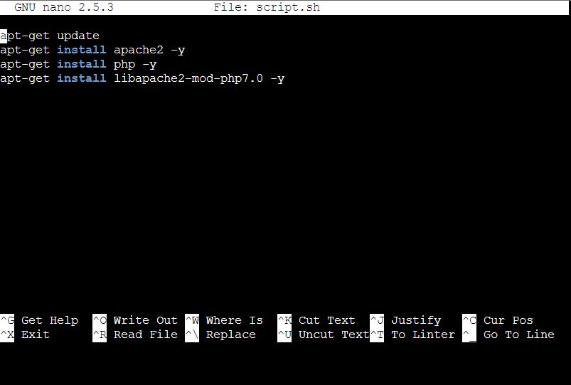

Kemudian melakukan `wget` untuk mendownload file yang diperlukan. Setelah itu diunzip sehinggan menampilkan folder-folder seperti ini.

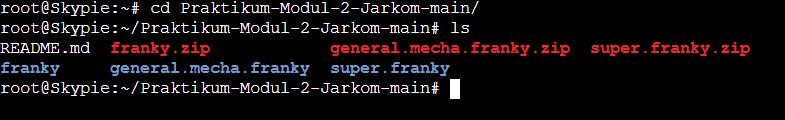

Setelah itu, pindah ke directory `/etc/apache2/sites-available`.Kemudian copy file `000-default.conf` menjadi file `franky.d05.com.conf`

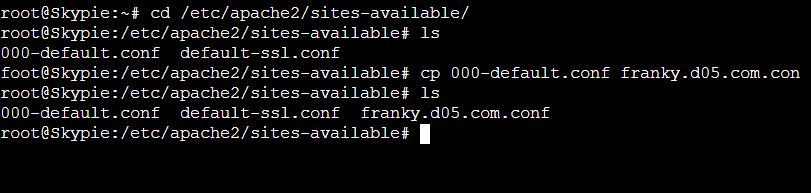

Lalu setting file `franky.d05.com.conf` agar memiliki line `ServerName franky.d05.com`, `ServerAlias www.franky.d05.com`, dan `DocumentRoot /var/www/franky.d05.com`.

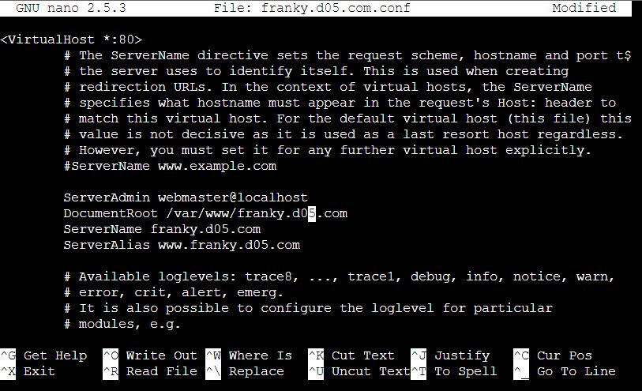

Kemudian bikin directory baru dengan nama `franky.d05.com` pada `/var/www/` menggunakan command `mkdir /var/www/franky.d05.com`. lalu copy isi dari folder `franky` yang telah didownload ke `/var/www/franky.d05.com`.

Setelah itu jalankan command `a2ensite franky.d05.com` dan `service apache2 restart`
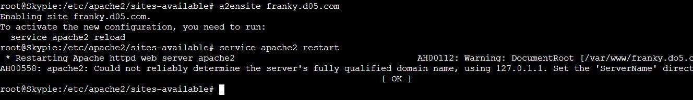

Ketika menjalankan command `lynx www.franky.d05.com` pada client akan muncul halaman
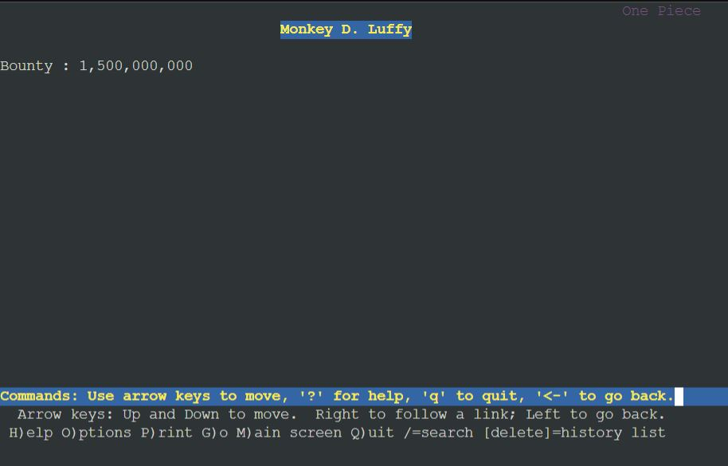

## no. 9

Setelah itu, Luffy juga membutuhkan agar url www.franky.yyy.com/index.php/home dapat menjadi menjadi www.franky.yyy.com/home.

### Jawab

Pertama, jalankan perintah `a2enmod rewrite` kemudian `service apache2 restart`.

Kemudian pindah ke directory `/var/www/franky.d05.com` dan buat file `.htaccess` dengan isi file:

```bash
    RewriteEngine On
    RewriteRule ^home$ index.php/home
```

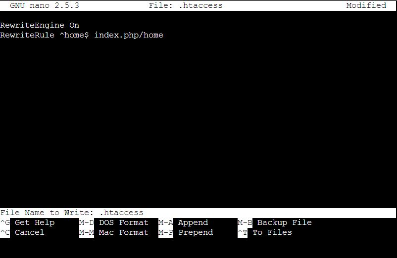

Kemudian buka file `/etc/apache2/sites-available/franky.d05.com.conf` dan tambahkan:

```bash
    <Directory /var/www/franky.d05.com>
        Options +FollowSymLinks -Multiviews
        AllowOverride All
    </Directory>
```

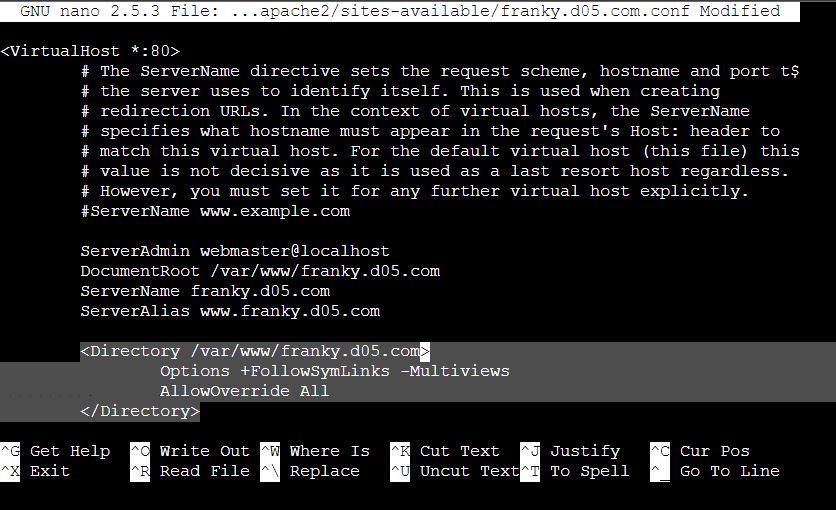

Ketika menjalankan command `lynx www.franky.d05.com/home` pada client akan muncul halaman
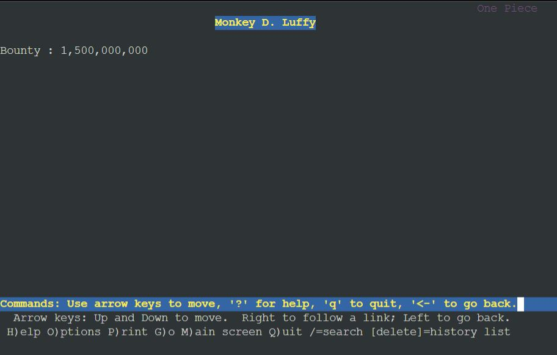

## no. 10

Setelah itu, pada subdomain www.super.franky.yyy.com, Luffy membutuhkan penyimpanan aset yang memiliki DocumentRoot pada /var/www/super.franky.yyy.com

### Jawab

Pertama, pindah ke directory `/etc/apache2/sites-available`.Kemudian copy file `000-default.conf` menjadi file `super.franky.d05.com.conf`

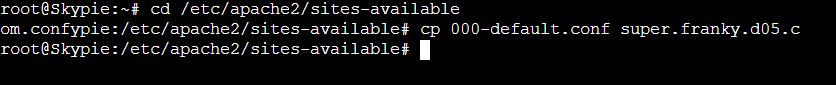

Lalu setting file `super.franky.d05.com.conf` agar memiliki line `ServerName super.franky.d05.com`, `ServerAlias www.super.franky.d05.com`, dan `DocumentRoot /var/www/super.franky.d05.com`.

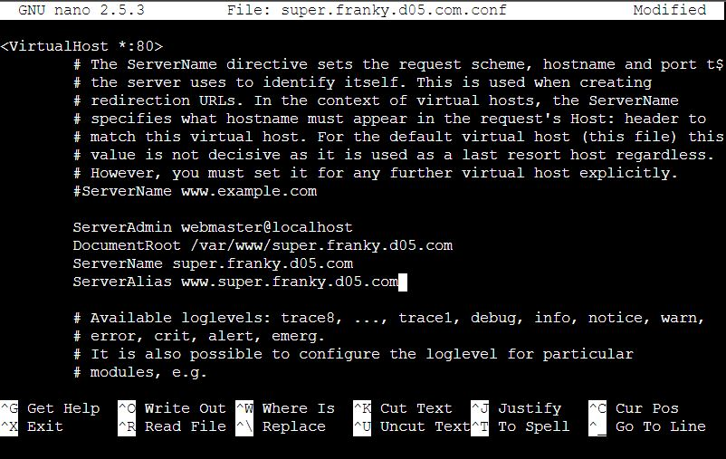

Kemudian bikin directory baru dengan nama `super.franky.d05.com` pada `/var/www/` menggunakan command `mkdir /var/www/super.franky.d05.com`. lalu copy isi dari folder `super.franky` yang telah didownload ke `/var/www/super.franky.d05.com`.

Setelah itu jalankan command `a2ensite super.franky.d05.com` dan `service apache2 restart`
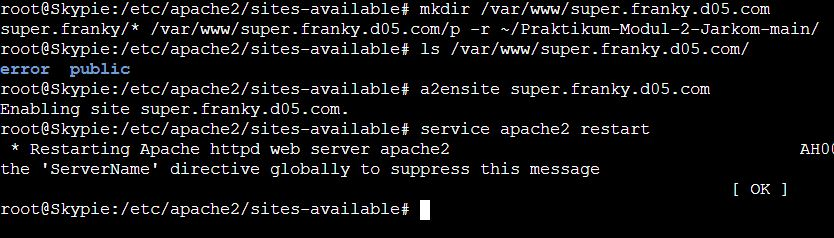

Ketika menjalankan command `lynx www.super.franky.d05.com` pada client akan muncul halaman
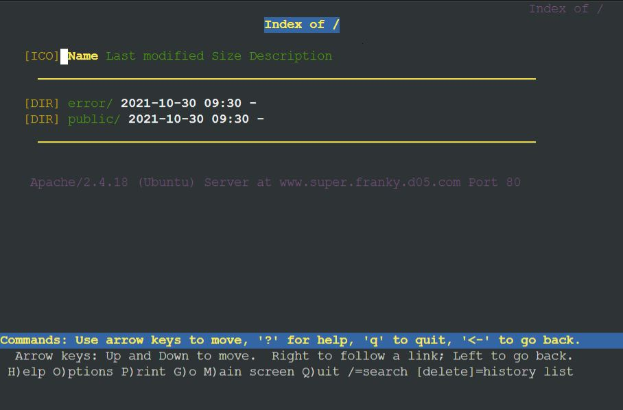

## no. 11

Akan tetapi, pada folder /public, Luffy ingin hanya dapat melakukan directory listing saja.

### Jawab

Pindah ke directory `/etc/apache2/sites-available` kemudian buka file `super.franky.d05.com` dan tambahkan:

```bash
    <Directory /var/www/super.franky.d05.com/public>
        Options +Indexes
    </Directory>
```

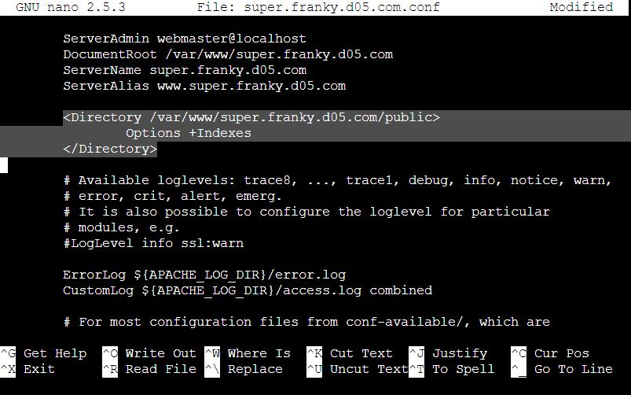

Ketika menjalankan command `lynx www.super.franky.d05.com/public` pada client akan muncul halaman
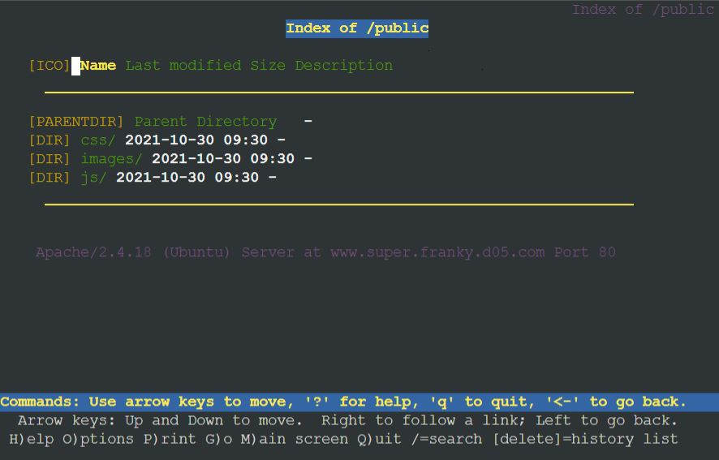

## no. 12

Tidak hanya itu, Luffy juga menyiapkan error file 404.html pada folder /errors untuk mengganti error kode pada apache .

### Jawab

Pindah ke directory `/etc/apache2/sites-available` kemudian buka file `super.franky.d05.com` dan tambahkan:

```bash
        ErrorDocument 404 /error/404.html
```

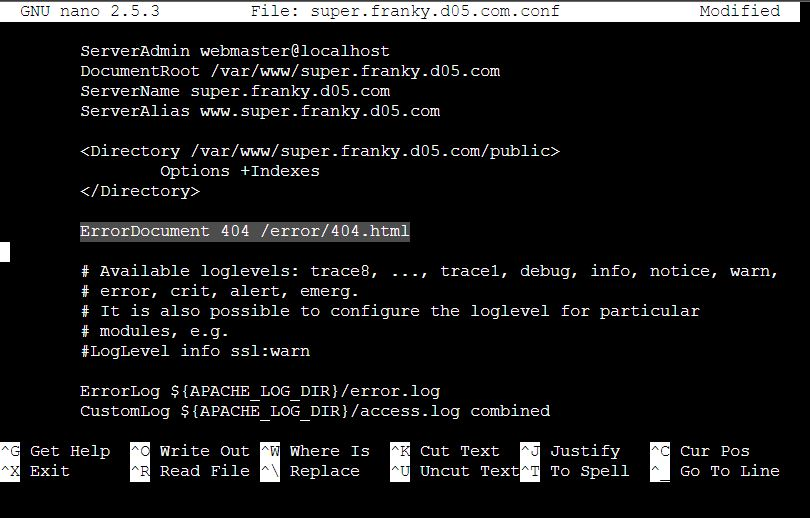

Ketika menjalankan command `lynx www.super.franky.d05.com/publi`(lokasi yang tidak ada) pada client akan muncul halaman
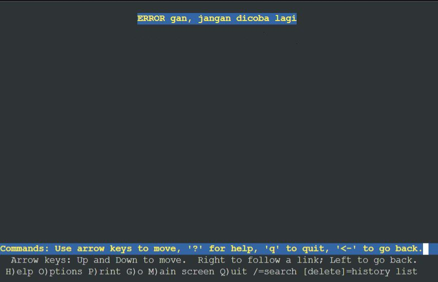

## no. 13

Luffy juga meminta Nami untuk dibuatkan konfigurasi virtual host. Virtual host ini bertujuan untuk dapat mengakses file asset www.super.franky.yyy.com/public/js menjadi www.super.franky.yyy.com/js.

### Jawab

Pindah ke directory `/etc/apache2/sites-available` kemudian buka file `super.franky.d05.com` dan tambahkan:

```bash
        Alias "/js" "/var/www/super.franky.d05.com/public/js"
```

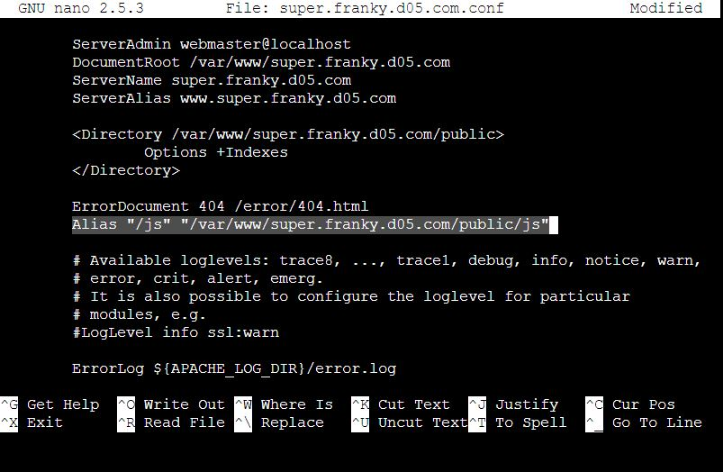

Ketika menjalankan command `lynx www.super.franky.d05.com/js` pada client akan muncul halaman
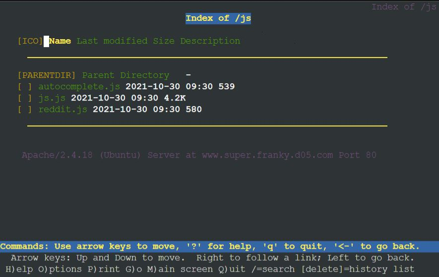

## no. 14

Dan Luffy meminta untuk web www.general.mecha.franky.yyy.com hanya bisa diakses dengan port 15000 dan port 15500.

### Jawab

Pertama, pindah ke directory `/etc/apache2/sites-available`.Kemudian copy file `000-default.conf` menjadi file `general.mecha.franky.d05.com.conf`

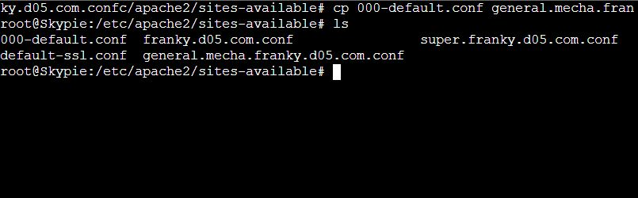

Lalu setting file `general.mecha.franky.d05.com.conf` agar memiliki `<VirtualHost *:15000 *:15500>`, line `ServerName general.mecha.franky.d05.com`, `ServerAlias www.general.mecha.franky.d05.com`, dan `DocumentRoot /var/www/general.mecha.franky.d05.com`.

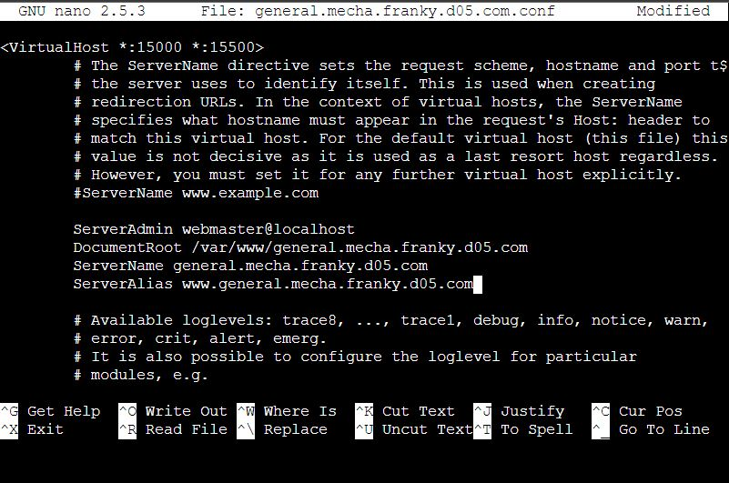

Kemudian tambahkan port 15000 dan 15500 pada file `/etc/apache2/ports.conf` dengan menambahkan:

```bash
    Listen 15000
    Listen 15500
```


Kemudian bikin directory baru dengan nama `general.mecha.franky.d05.com` pada `/var/www/` menggunakan command `mkdir /var/www/general.mecha.franky.d05.com`. lalu copy isi dari folder `general.mecha.franky` yang telah didownload ke `/var/www/general.mecha.franky.d05.com`.

Setelah itu jalankan command `a2ensite general.mecha.franky.d05.com` dan `service apache2 restart`
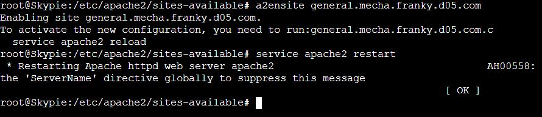

Ketika menjalankan command `lynx www.general.mecha.franky.d05.com:15000` atau `lynx www.general.mecha.franky.d05.com:15500` pada client akan muncul halaman
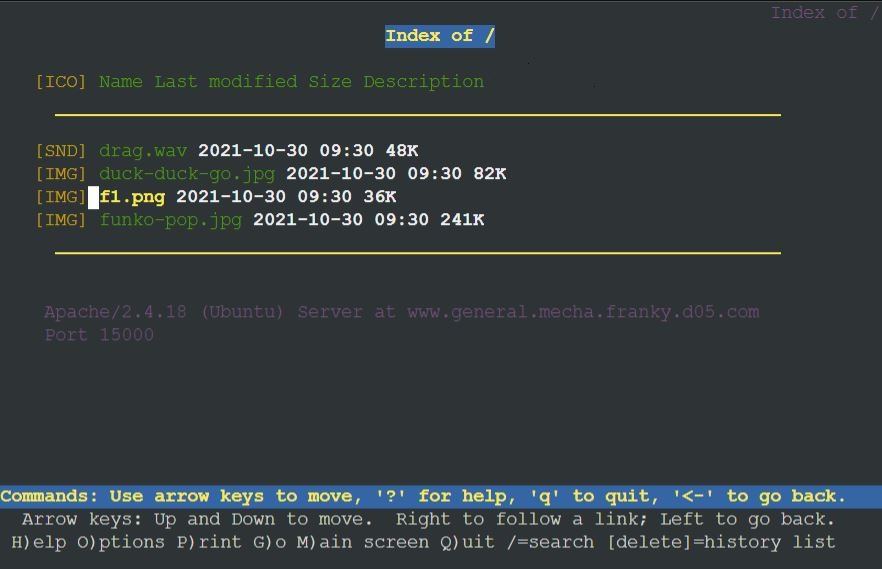

## no. 15

dengan authentikasi username luffy dan password onepiece dan file di /var/www/general.mecha.franky.yyy

### Jawab

Pertama, jalankan command `htpasswd -c /etc/apache2/.htpasswd luffy` untuk membuat file yang menyimpan username dan password kedalam file `/etc/apache2/.htpasswd` dengan user `luffy`, lalu akan ada prompt untuk memasukkan dan mengkonfirmasi password.

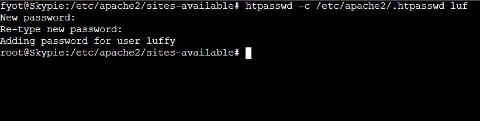
Kemudian, edit file `/etc/apache2/sites-available/general.mecha.franky.d05.com.conf` dengan menambahkan:

```bash
    <Directory /var/www/general.mecha.franky.d05.com>
        Options +FollowSymLinks -Multiviews
        AllowOverride All
    </Directory>
```

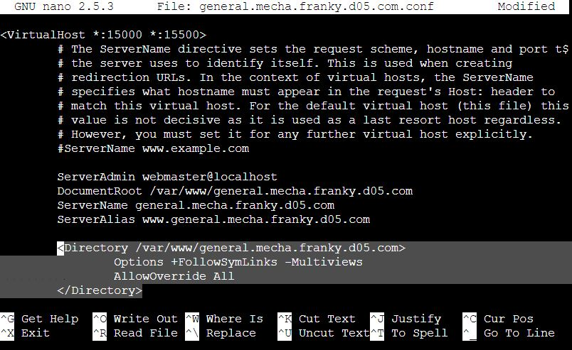

Lalu, edit file `/var/www/general.mecha.franky.d05.com/.htaccess` menjadi:

```bash
    AuthType Basic
    AuthName "Restricted Content"
    AuthUserFile /etc/apache2/.htpasswd
    Require valid-user
```

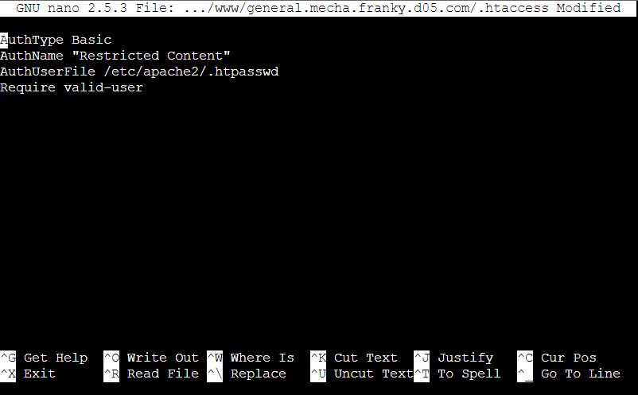

Ketika menjalankan command `lynx www.general.mecha.franky.d05.com:15000` atau `lynx www.general.mecha.franky.d05.com:15500` pada client akan muncul halaman yang meminta autentikasi
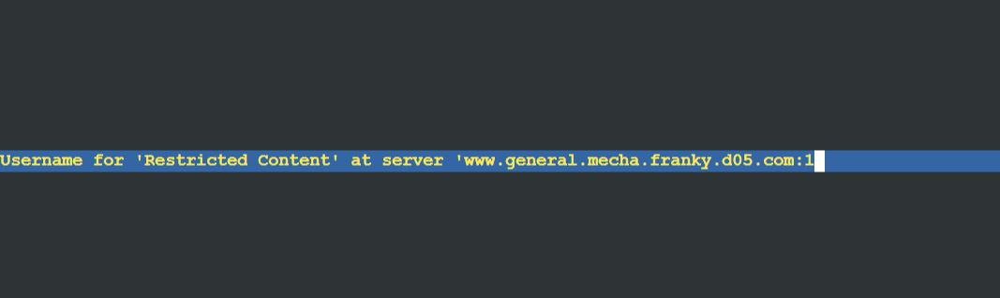
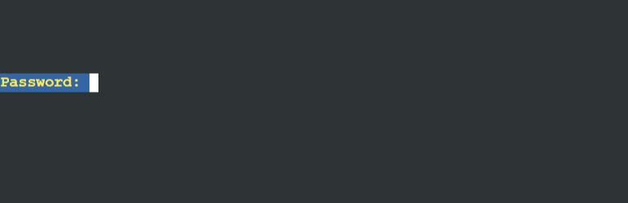

## no. 16

Dan setiap kali mengakses IP EniesLobby akan diahlikan secara otomatis ke www.franky.yyy.com

### Jawab

Problem : Karena tidak bisa mengakses IP EniesLobby, maka IP yang kami alihkan adalah ketika mengakses IP Skypie
Edit file `/var/www/html/.htaccess` dengan menambahkan:

```bash
    RewriteEngine On
    RewriteBase /
    RewriteCond %{HTTP_HOST} ^192\.194\.2\.4$
    RewriteRule ^(.*)$ http://www.franky.d05.com [L,R=301]
```

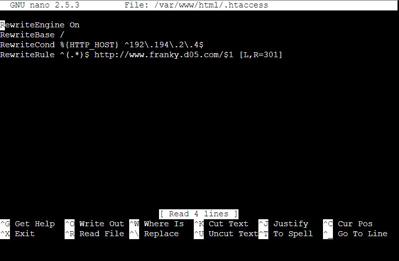

Kemudian, edit file `/etc/apache2/sites-available/000-default.conf` dengan menambahkan:

```bash
    <Directory /var/www/html>
        Options +FollowSymLinks -Multiviews
        AllowOverride All
    </Directory>
```

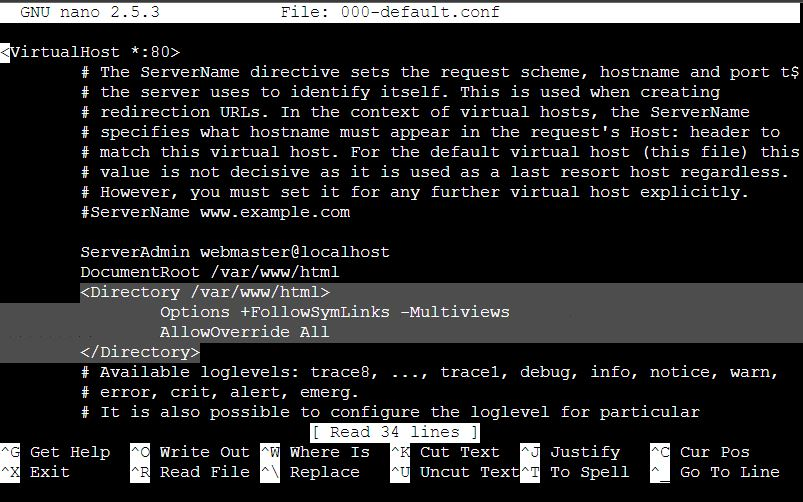

Ketika menjalankan command `lynx 192.194.2.4` pada client akan muncul halaman


## no. 17

Dikarenakan Franky juga ingin mengajak temannya untuk dapat menghubunginya melalui website www.super.franky.yyy.com, dan dikarenakan pengunjung web server pasti akan bingung dengan randomnya images yang ada, maka Franky juga meminta untuk mengganti request gambar yang memiliki substring “franky” akan diarahkan menuju franky.png.

### Jawab

Pertama, edit file `/etc/apache2/sites-available/super.franky.d05.com.conf` dengan menambahkan:

```bash
    <Directory /var/www/super.franky.d05.com>
        Options +FollowSymLinks -Multiviews
        AllowOverride All
    </Directory>
```

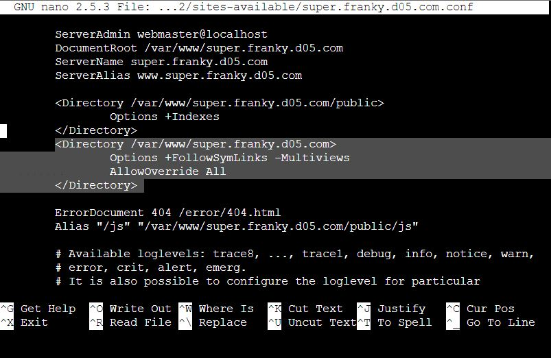

Kemudian, edit file `/var/www/super.franky.d05.com/.htaccess` dengan menambahkan:

```bash
    RewriteEngine On
    RewriteCond %{REQUEST_FILENAME} !franky.png
    RewriteRule ^(.*)franky(.*)\.(jpg|gif|png)$ http://super.franky.d05.com/public/images/franky.png [L,R]
```

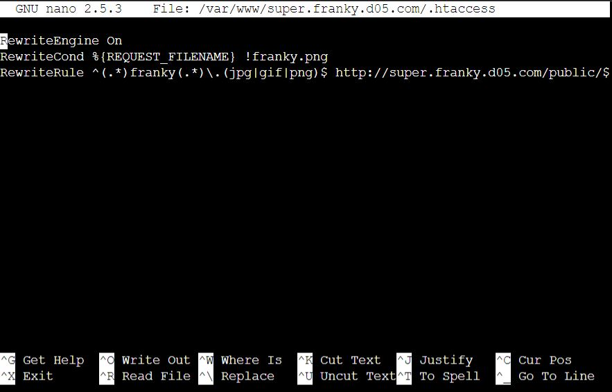

Ketika menjalankan command `lynx super.franky.d05.com/public/images/franky.png` pada client akan muncul halaman


Ketika menjalankan command `lynx super.franky.d05.com/public/images/not-franky.JPG` pada client akan muncul halaman
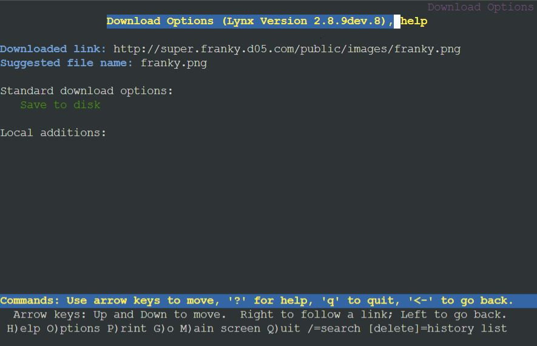

Ketika menjalankan command `lynx super.franky.d05.com/public/images/car.JPG` pada client akan muncul halaman
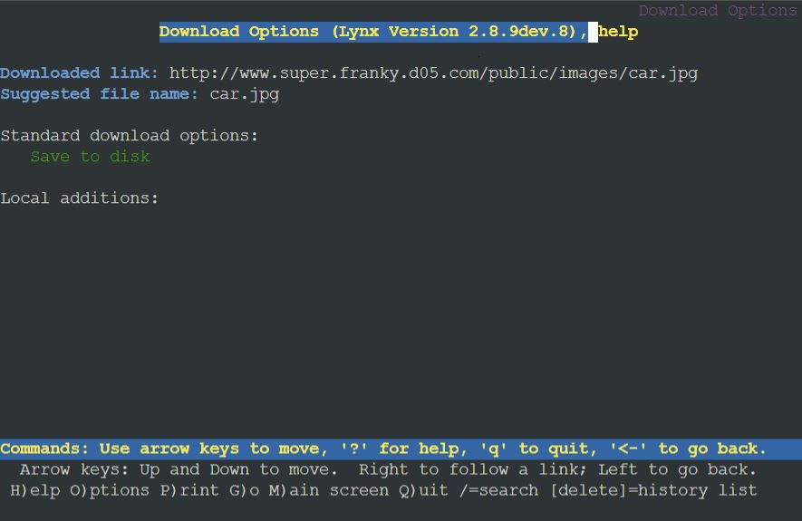
