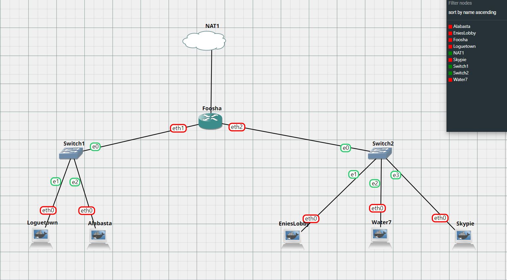

# Praktikum Modul 2

- Andika Nugrahanto (0511194000031)
- Muhammad Rayhan Raffi Pratama (05111940000110)
- Fadhil Dimas Sucahyo (05111940000212)

## Pendahuluan

### Setting Topologi



### Edit Konfigurasi Network

#### Foosha (Router)


#### EniesLobby (DNS Master)


#### Water7 (DNS Slave)


#### Skypie (Web Server)


#### Loguetown (Client)


#### Alabasta (Client)


## no. 1

EniesLobby akan dijadikan sebagai DNS Master, Water7 akan dijadikan DNS Slave, dan Skypie akan digunakan sebagai Web Server. Terdapat 2 Client yaitu Loguetown, dan Alabasta. Semua node terhubung pada router Foosha, sehingga dapat mengakses internet

### Jawab

Menjalankan command `iptables -t nat -A POSTROUTING -o eth0 -j MASQUERADE -s 192.194.0.0/16` yang digunakan supaya dapat terhubung ke jaringan luar pada router `Foosha`


Kemudian menambahkan command `iptables -t nat -A POSTROUTING -o eth0 -j MASQUERADE -s 192.194.0.0/16` ke `/root/.bashrc` agar dijalankan setiap kali project distart dengan command `echo "iptables -t nat -A POSTROUTING -o eth0 -j MASQUERADE -s 192.194.0.0/16" >> /root/.bashrc`


Setelah itu pada semua node lainnya ditambahkan command `echo "nameserver 192.168.122.0"` untuk setting IP DNS ke `/root/.bashrc` agar dijalankan setiap kali project distart dengan command `echo 'echo "nameserver 192.168.122.1" > /etc/resolv.conf' >> /root/.bashrc`


## no. 2

membuat website utama dengan mengakses franky.yyy.com dengan alias www.franky.yyy.com pada folder kaizoku

### Jawab

pada EniesLobby jalankan command `apt-get update` dan `apt-get install bind9 -y` untuk menginstall bind9


Kemudian mengedit `/etc/bind/named.conf.local` dengan menambahkan :

```bash
    zone "franky.d05.com" {
            type master;
            file "/etc/bind/kaizoku/franky.d05.com";
    };
```


lalu dibuat folder kaizoku di `/etc/bind`. Lalu copy `/etc/bind/db.local` menjadi `/etc/bind/kaizoku/franky.d05.com`. Lalu konfigurasi file tersebut agar memiliki SOA `franky.d05.com.`, NS `franky.d05.com.`, record A yang mengarah ke `IP Skypie`, dan CNAME `www` pada `franky.d05.com.`.


## no. 3

Setelah itu buat subdomain super.franky.yyy.com dengan alias www.super.franky.yyy.com yang diatur DNS nya di EniesLobby dan mengarah ke Skypie.

### Jawab

Mengedit file `/etc/bind/kaizoku/franky.d05.com` dengan menambahkan:

```bash
        super   IN      A       192.194.2.4
        www.super       IN      CNAME   super.franky.d05.com.
```


## no. 4

Buat juga reverse domain untuk domain utama

### jawab

Pertama, menambahkan zone pada `/etc/bind/named.conf.local` dengan menambahkan:

```bash
    zone "2.194.192.in-addr.arpa" {
            type master;
            file "/etc/bind/kaizoku/2.194.192.in-addr.arpa";
    };
```


Lalu copy `/etc/bind/db.local` menjadi `/etc/bind/kaizoku/2.194.192.in-addr.arpa`. Lalu konfigurasi file tersebut agar memiliki SOA `franky.d05.com.`,`2.194.192.in-addr.arpa.` yang memiliki NS `franky.d05.com.`, dan `4` yang merupakan byte ke-4 IP EniesLobby memiliki PTR `franky.d05.com.`.


## no. 5

Supaya tetap bisa menghubungi Franky jika server EniesLobby rusak, maka buat Water7 sebagai DNS Slave untuk domain utama

### jawab

Di EniesLobby:

Pertama edit zone `franky.d05.com` pada `/etc/bind/named.conf.local` menjadi:

```bash
    zone "franky.d05.com" {
            type master;
            notify yes;
            also-notify { 192.194.2.3; };
            allow-transfer { 192.194.2.3; };
            file "/etc/bind/kaizoku/franky.d05.com";
    };
```


Di Water7:
Jalankan command `apt-get update` dan `apt-get install bind9 -y` untuk menginstall bind9

Kemudian mengedit `/etc/bind/named.conf.local` dengan menambahkan :

```bash
    zone "franky.d05.com" {
        type slave;
        masters { 192.194.2.2; };
        file "/var/lib/bind/franky.d05.com";
    };
```


## no. 6

Setelah itu terdapat subdomain mecha.franky.yyy.com dengan alias www.mecha.franky.yyy.com yang didelegasikan dari EniesLobby ke Water7 dengan IP menuju ke Skypie dalam folder sunnygo.

### Jawab

Di EniesLobby:

Pertama, mengedit file `/etc/bind/kaizoku/franky.d05.com` dengan menambahkan:

```bash
        ns1     IN      A       192.194.2.3 ; IP Water7
        mecha   IN      NS      ns1
```


Kemudian mengedit file `/etc/bind/named.conf.options` dengan comment bagian `dnssec-validation auto;` dan menambahkan line `allow-query{any;};`.


Pastikan sudah ada line `allow-transfer { "IP Water7"; };` pada zone `franky.d05.com` di file `/etc/bind/named.conf.local`.


Di Water7:

Pertama edit file `/etc/bind/named.conf.options` dengan comment bagian `dnssec-validation auto;` dan menambahkan line `allow-query{any;};`.


Kemudian menambahkan zone pada `/etc/bind/named.conf.local` dengan menambahkan:

```bash
    zone "mecha.franky.d05.com" {
            type master;
            file "/etc/bind/sunnygo/mecha.franky.d05.com";
    };
```


lalu dibuat folder sunnygo di `/etc/bind`. Lalu copy `/etc/bind/db.local` menjadi `/etc/bind/sunnygo/mecha.franky.d05.com`. Lalu konfigurasi file tersebut agar memiliki SOA `mecha.franky.d05.com.`, NS `mecha.franky.d05.com.`, record A yang mengarah ke `IP Skypie`, dan CNAME `www` pada `mecha.franky.d05.com.`.


## no. 7

Untuk memperlancar komunikasi Luffy dan rekannya, dibuatkan subdomain melalui Franky dengan nama general.mecha.franky.yyy.com dengan alias www.general.mecha.franky.yyy.com yang mengarah ke Skypie.

### Jawab

Di Water7:

Mengedit file `/etc/bind/sunnygo/mecha.franky.d05.com` dengan menambahkan:

```bash
        general IN      A       192.194.2.4 ; IP Skypie
        www.general     IN      CNAME   general.mecha.franky.d05.com.
```


